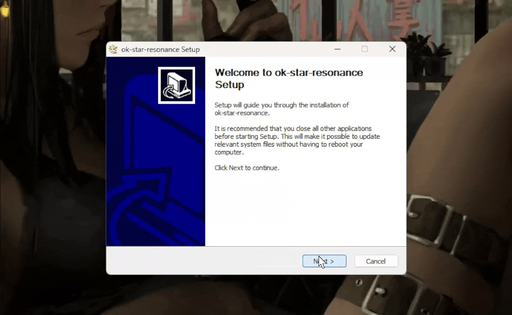

# 🎣 Fishing Script

I am just going to use the same discord steps that were already made, but just add detail where needed.

***

## BLUE PROTOCOL STAR RESONANCE FISHING BOT,

Repository: [https://github.com/Sanheiii/ok-star-resonance](https://github.com/Sanheiii/ok-star-resonance)\
\
⚙️ **Pre-Requisite**: \
You must have Python 3.12 installed:\
📩 **Download**: [Python 3.12.0](https://www.python.org/downloads/release/python-3120/)

👨‍💻 <mark style="color:$success;">**Iso's Insight**</mark>:

*   For most people scroll down to the bottom of that page where it says "Files" and click "Windows installer (64-bit)". If you need more clarification the description of it in the middle column will say "Recommended".

    <figure><figcaption></figcaption></figure>

\|-|\
\
📦 **Installing the Required Module**:\
After installing Python globally, you’ll need to install the pynput module directly inside your ok-star-resonance app folder. \
\
**App Path Example**:

```
%localappdata%\ok-star-resonance\data\apps\ok-star-resonance\python
```

<mark style="color:$success;">👨‍💻</mark> <mark style="color:$success;"></mark><mark style="color:$success;">**Iso's Insight**</mark>:

* This is where some people can get confused. The above just gives and example of the path. But they do not explain how the path gets there.
* **Steps to make that directory and continue with the guide:**
  * Download the latest version: [https://github.com/Sanheiii/ok-star-resonance/releases](https://github.com/Sanheiii/ok-star-resonance/releases) (As of 10/15/2025 that is '_v0.0.17_') That latest version will in most instances be at the top.&#x20;
  *   Under that release you will see a table labeled "Assets" which will have the files you want. In this case you want "ok-star-resonance-win32-Global-setup.exe".<br>

      <figure><figcaption></figcaption></figure>
  *   Once installed you will want to run that .exe. Just follow the prompts during the install. You can uncheck the box at the end so it does not launch it when you hit "Finish"<br>

      <figure><figcaption></figcaption></figure>
  * From there you will see that directory in the example earlier has been made at `C:\Users\USER\AppData\Local\ok-star-resonance`&#x20;
* Now we can continue....

**🧭 Step-by-Step**

> 1. Open Command Prompt
> 2. Paste the following line, replacing the "." with your actual app folder path if you want to target it directly:

```
pip install pynput --target="."
```

**👨‍💻&#x20;**<mark style="color:$success;">**Iso's Insight**</mark>**:**

* &#x20;We will just make this simple to avoid confusion.
  * Go  to the directory mentioned in my previous note (The one where "ok-star-resonance" installed to). _C:\Users\USER\AppData\Local\ok-star-resonance_
    * Easiest way to get there is hit your windows key on your keyboard + R and type '_%localappdata%_' and you will see the **'ok-star-resonance**' folder in there.
  * Once in the directory click in the bar to the left of the search bar where it shows the folder(s) you are in and type cmd then hit enter on your keyboard. This will automatically open the CMD in the '**ok-star-resonance**' folder.
  *   Once you are in the CMD terminal that popped up, just paste in: `pip install pynput --target="."` then hit enter on your keyboard.<br>

      <figure><figcaption></figcaption></figure>
* If your output in the CMD window was the same as mine you should be good with the install now and can continue following the original guide.

\|-|

✅ After Installing the Module Once _pynput_ is installed successfully:

> 1. Open BPSR,
> 2. Launch ok-star-resonance,
> 3. Click Start / 开始 (F9),
> 4. Go to the third sidebar option → “实时触发”,
> 5. Enable 自动钓鱼 (Auto-Fishing),

It’s the first toggle under “实时触发.” The dropdown toggle under it allows automatic switching between fishing rods (in case one breaks).

> 6. Finally, interact with a fishing spot inside BPSR to start.,

⚠️ Do not use any features under the second sidebar (“诊断 / Diagnostics”). Make sure BPSR’s language is set to Simplified Chinese. This ensures proper OCR recognition by the “ok-star-resonance” app.
